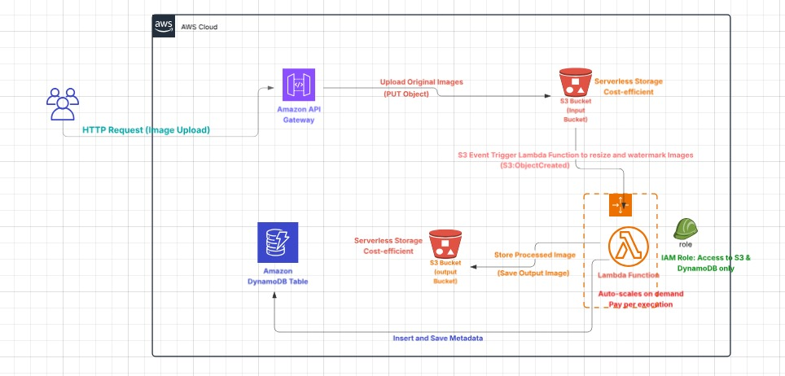

# Serverless Image Processing Architecture on AWS

## Introduction

This repository showcases a robust and cost-efficient serverless architecture on Amazon Web Services (AWS) designed for handling image uploads, processing (resizing and watermarking), and metadata management. This solution leverages the power of various AWS services to provide a scalable and highly available image processing pipeline.

## Project Goal

The primary goal of this project is to demonstrate a practical and efficient way to automate image processing tasks in the cloud. It aims to reduce operational overhead by using serverless components and optimize costs by paying only for actual usage.

## Key Components

This architecture utilizes the following AWS services:

1.  **Amazon API Gateway:** Acts as the single entry point for external HTTP requests (e.g., image uploads). It provides a secure and scalable way to expose backend services.
2.  **Amazon S3 (Simple Storage Service):** Used for highly durable and available object storage.
    * **Input Bucket:** Stores the original uploaded images.
    * **Output Bucket:** Stores the processed (resized and watermarked) images.
3.  **AWS Lambda:** A serverless compute service that runs code in response to events.
    * In this architecture, a Lambda function is triggered when a new image is uploaded to the S3 Input Bucket.
    * It performs the core logic: resizing the image and adding a watermark.
    * It's `Auto-scales on demand` and follows a `Pay-per-execution` model.
    * **IAM Role:** The Lambda function is assigned an IAM Role (`Access to S3 & DynamoDB only`) to ensure it has the necessary permissions to read from the input S3 bucket, write to the output S3 bucket, and interact with DynamoDB.
4.  **Amazon DynamoDB Table:** A fast and flexible NoSQL database service.
    * Used to store metadata related to the uploaded and processed images (e.g., original file name, processed file name, timestamp, image dimensions, etc.).

## Workflow

The image processing workflow proceeds as follows:

1.  **HTTP Request (Image Upload):** A user initiates an image upload via an HTTP request, which is routed through Amazon API Gateway.
2.  **Upload Original Images (PUT Object):** API Gateway securely uploads the original image as a PUT Object to the `S3 Bucket (Input Bucket)`. This bucket is designed for `Serverless Storage Cost-efficient`.
3.  **S3 Event Trigger:** An `S3 Event Trigger Function` (specifically, `S3:ObjectCreated`) is configured on the Input S3 Bucket. When a new image is successfully uploaded, this event triggers the AWS Lambda function.
4.  **Lambda Function Processing:**
    * The Lambda function retrieves the newly uploaded image from the Input S3 Bucket.
    * It then performs the necessary image manipulations: resizing the image to desired dimensions and applying a watermark.
    * After processing, the `Store Processed Image` step saves the modified image to the `S3 Bucket (Output Bucket)`, which is also `Serverless Storage Cost-efficient`.
5.  **Insert and Save Metadata:** Concurrently, the Lambda function also `Insert and Save Metadata` about both the original and processed images into the `Amazon DynamoDB Table`. This metadata can include details like file paths, sizes, dates, and any other relevant information.

## Architecture Diagram

The following diagram illustrates the flow and interaction between the various AWS services in this serverless image processing solution:

*(Please make sure the image filename `aws-serverless-image-processing-architecture.png` matches exactly what you uploaded and renamed.)*

## Features

* **Serverless:** No servers to provision or manage, reducing operational overhead.
* **Cost-Efficient:** Pay-per-execution model for Lambda and cost-effective S3 storage.
* **Auto-Scales on Demand:** Automatically scales to handle varying loads without manual intervention.
* **Highly Available & Durable:** Leverages AWS services known for their reliability and data durability.
* **Automated Processing:** Automates the tedious tasks of image resizing and watermarking.
* **Metadata Management:** Centralized storage of image metadata in DynamoDB.

## Conclusion

This serverless architecture provides a highly scalable, efficient, and cost-effective solution for handling image uploads and processing on AWS. It serves as an excellent example of how serverless technologies can be leveraged to build robust cloud applications.
